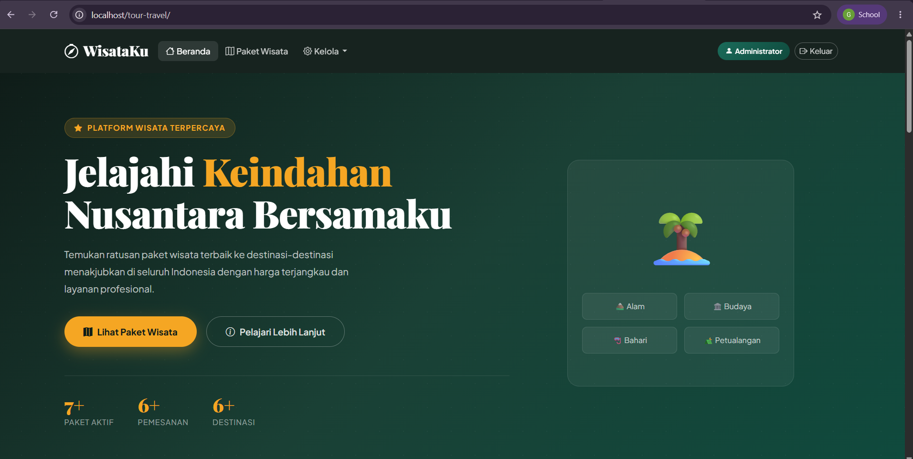
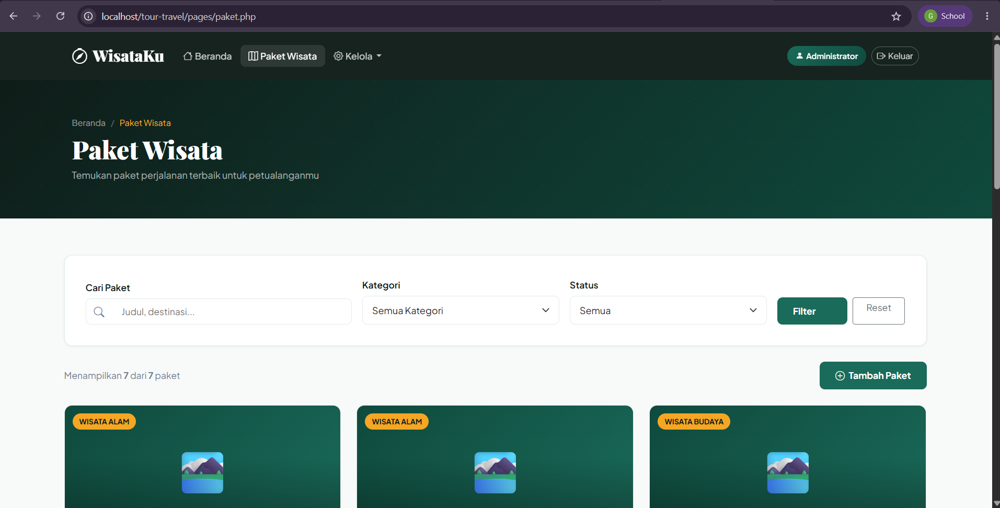
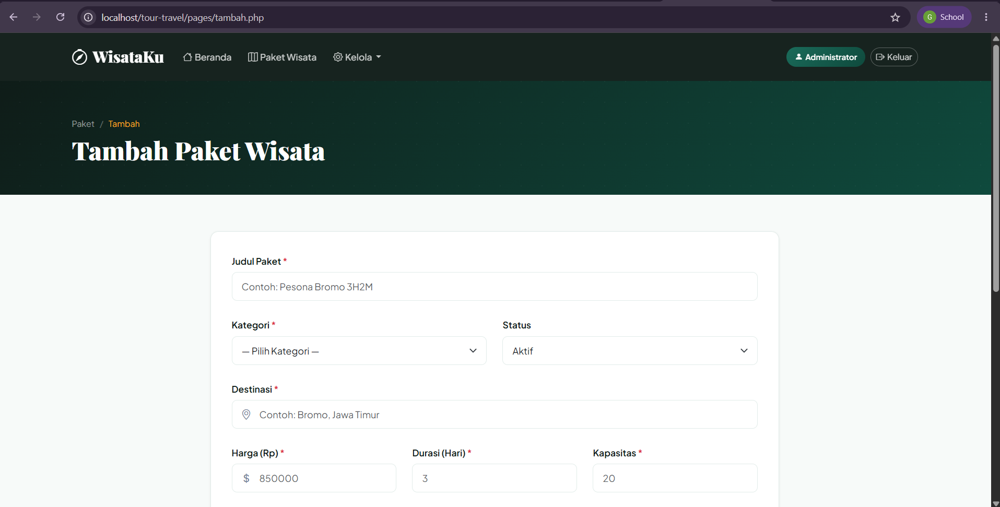
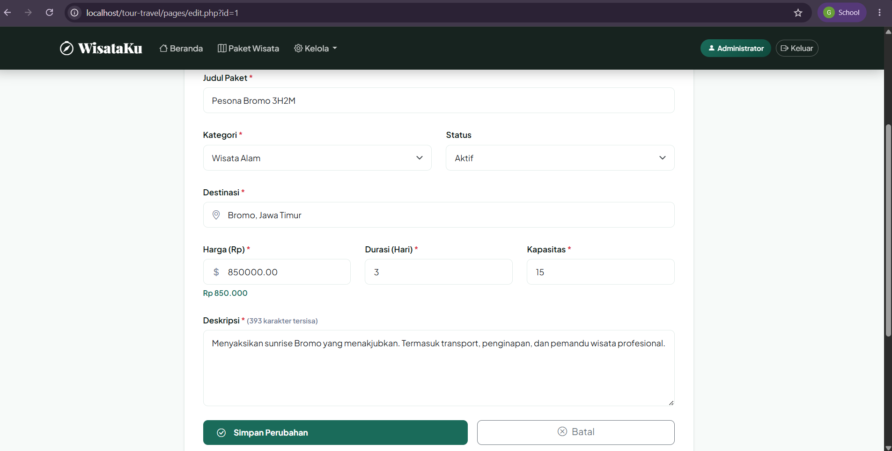
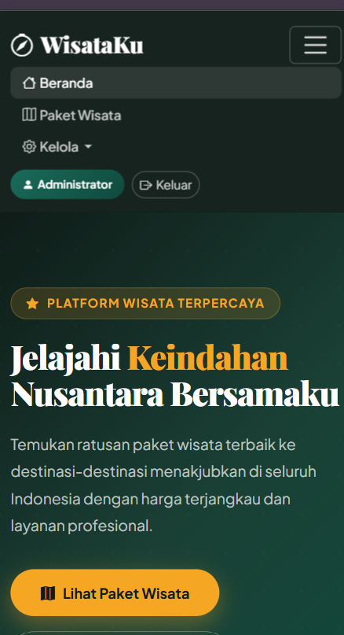

# 🌴 WisataKu — Aplikasi Manajemen Tour & Travel

Aplikasi web manajemen paket wisata berbasis PHP & MySQL dengan tampilan Bootstrap 5 yang responsif.



## 📋 Deskripsi Project

WisataKu adalah sistem manajemen tour dan travel yang memungkinkan admin untuk mengelola paket wisata secara lengkap. Dibangun menggunakan PHP native, MySQL, dan Bootstrap 5.

### Fitur Utama
- 🏠 Landing page responsif dengan hero section
- 📋 Daftar paket wisata dengan search & filter & pagination
- ➕ Form tambah paket dengan validasi JavaScript
- ✏️ Form edit data dengan konfirmasi perubahan
- 🗑️ Hapus data dengan konfirmasi JavaScript
- 🔐 Autentikasi login admin dengan session & password_hash
- 📱 Tampilan responsif di semua ukuran layar (375px - 1440px)

## 🛠️ Teknologi

| Teknologi | Versi |
|-----------|-------|
| PHP | 8.x |
| MySQL | 8.x |
| Bootstrap | 5.3.3 |
| Bootstrap Icons | 1.11.3 |
| Laragon | 6.x |

## 📁 Struktur Folder
tour-travel/
├── assets/
│   ├── css/style.css
│   ├── js/main.js
│   └── img/screenshots/
├── includes/
│   ├── config.php
│   ├── header.php
│   └── footer.php
├── pages/
│   ├── login.php
│   ├── logout.php
│   ├── paket.php
│   ├── detail.php
│   ├── tambah.php
│   ├── edit.php
│   ├── hapus.php
│   └── pemesanan.php
├── index.php
├── database.sql
├── .gitignore
└── README.md
## ⚙️ Cara Install & Menjalankan

### Prasyarat
- [Laragon](https://laragon.org/download) sudah terinstall
- PHP 8.x
- MySQL 8.x

### Langkah Instalasi

**1. Clone repository**
```bash
git clone https://github.com/USERNAME/tour-travel.git
```
Pindahkan folder ke: C:\laragon\www\tour-travel
**2. Import database**
- Buka Laragon → Start All
- Buka HeidiSQL → buat database `tour_travel`
- Import file `database.sql`

**3. Konfigurasi database**

Edit file `includes/config.php`:
```php
define('DB_HOST', 'localhost');
define('DB_USER', 'root');
define('DB_PASS', '');
define('DB_NAME', 'tour_travel');
define('APP_URL',  'http://localhost/tour-travel');
```

**4. Generate password admin**

Buat file `gen_pass.php` sementara:
```php
<?php echo password_hash('admin123', PASSWORD_DEFAULT); ?>
```
Buka `http://localhost/tour-travel/gen_pass.php`, copy hash-nya, lalu:
```sql
UPDATE pengguna SET password='HASH_DISINI' WHERE email='admin@wisataku.id';
```
Hapus file `gen_pass.php` setelah selesai.

**5. Akses aplikasi**
http://localhost/tour-travel/
## 🔐 Akun Demo

| Role | Email | Password |
|------|-------|----------|
| Admin | admin@wisataku.id | admin123 |

## 🗄️ Struktur Database

| Tabel | Keterangan |
|-------|-----------|
| `kategori` | Master kategori wisata |
| `pengguna` | Data pengguna & admin |
| `paket_wisata` | Data paket wisata |
| `pemesanan` | Data transaksi pemesanan |
| `pembayaran` | Data pembayaran |
| `ulasan` | Rating & ulasan pelanggan |

**View:** `v_paket_populer`, `v_riwayat_pemesanan`

**Fungsi:** `hitung_total_harga()`, `get_rata_rating()`

**Trigger:** `trg_after_pemesanan_insert`, `trg_after_pemesanan_update`

## 📸 Screenshot

### Halaman Beranda


### Daftar Paket Wisata


### Form Tambah Paket


### Form Edit Paket


### Tampilan Mobile (375px)


## 👨‍💻 Developer

- **Nama:** Galen Dzakwan Huberta
- **NIM:** 25/556857/SV/26034
- **Kelas:** PL2B1
